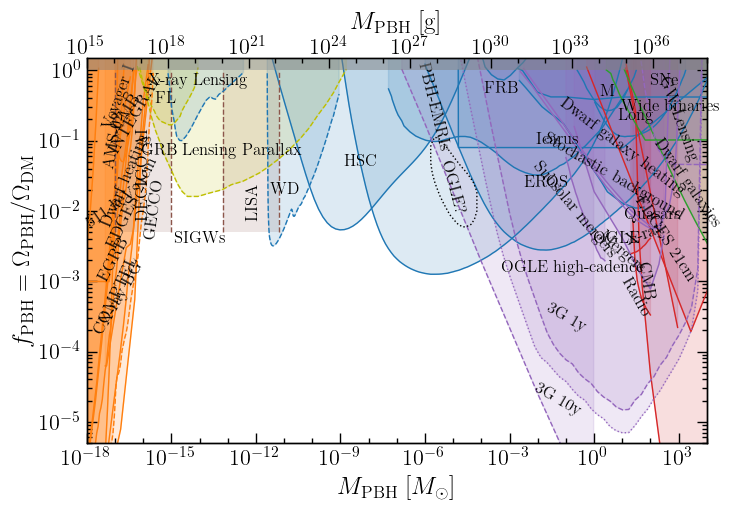

## PBHbounds

[](https://zenodo.org/badge/latestdoi/220053456) [](http://arxiv.org/abs/2007.10722) [](https://opensource.org/licenses/MIT)

*A collection of bounds on primordial black holes (PBHs) and code for plotting them.*

 


### Bounds

The list of available, tabulated bounds is in the [bounds/](bounds/) folder (see the readme there). The fact that I've included or omitted a particular bound shouldn't be taken as an endorsement or otherwise. I'll leave the user to exercise their own judgement when choosing which bounds are relevant. Note also that some of the bounds plotted above as dashed lines are projections.

### Contributing

If you'd like to add a bound to the repo, there are a few options:
1. Make the changes yourself:
	* Add the new bound as a `.txt` file in the [bounds/](bounds/) folder. Each file should have two columns, corresponding to the PBH mass in Solar mass, and the constraint on the PBH fraction. Also include a comment at the top of the file giving a link to the source of the bound.  
	* Update the [bounds/README.md](https://github.com/bradkav/PBHbounds/blob/master/bounds/README.md) file with information about the new bound.
	* Submit a pull request
2. Create an issue here on the github repo, pointing to the paper/bound which is missing.  
3. Contact me directly at bradkav@gmail.com and let me know which bound you think should be added.

### Plots

Some example plots summarising the bounds are in the [plots/](plots/) folder.

You can produce a plot with
```
python PlotPBHbounds.py -listfile LIST_FILE -outfile OUT_FILE
```
where `LIST_FILE` is a text file containing a list of bounds to be plotted (see `listfiles/list_all.txt` for an example) and `OUT_FILE` is the full filename of the image to be output (e.g. `plots/PBHbounds.pdf`). You can use the short flags `-lf` and `-of` for specifying the list file and output file.

A dark theme (with black background and white text) can be set using the flag `--dark`.

The plot style and some of the bounds are inspired by [arXiv:1801.00808](https://arxiv.org/abs/1801.00808).

Constraints on the primordial power spectrum can be plotted with
```
python PlotPSbounds.py
```
which is roughly inspired by plots from [arXiv:1811.11158](https://arxiv.org/abs/1811.11158), [arXiv:1812.00674](https://arxiv.org/abs/1812.00674) and [arXiv:1909.01593](https://arxiv.org/abs/1909.01593).

### Versions

**Updates:**
- 19/03/2024: Added new OGLE and AMS-02 bounds.
- 22/03/2022: Added new bounds from microlensing of quasars ([arXiv:2203.04777](https://arxiv.org/abs/2203.04777))
- 07/03/2022: Added long duration microlensing constraints from [arXiv:2202.13819](https://arxiv.org/abs/2202.13819)  
- 22/02/2022: Added new EDGES 21cm constraints from Mittal et al. (2021), presented in [arXiv:2107.02190](https://arxiv.org/abs/2107.02190)  
- 04/05/2021: Added some projected constraints in the asteroid-mass region, as well as a new flag for dark themes.
- 24/03/2021: Added Lyman alpha forest constraint and SKA forecast, shown in [arXiv:2103.12087](https://arxiv.org/abs/2103.12087).
- 13/01/2021: Added code for plotting Power Spectrum constraints (Fig. 1 of PBH review).
- 20/07/2020: Substantial updates, to coincide with PBH review article (more details to follow).
- 07/01/2020: added bounds on PBH evaporation from 511 keV gamma ray line

**Version 1.0 (12/11/2019):** Release version. Created for the first [GW4FP workshop](https://indico.cern.ch/event/843270/) (Amsterdam 2019).

### Citation

Feel free to use the bounds and code for anything you like, but please link to the repo if you do and cite the DOI: [10.5281/zenodo.3538999](https://doi.org/10.5281/zenodo.3538999).

Please also get in touch to let me know you've used the code. That way I can keep track! Thanks.

### Papers using PBHbounds

An incomplete list of papers which make use of PBHbounds. Please get in touch if you've used the code or digitised bounds, so I can keep track!

- *Primordial Black Holes as a dark matter candidate -- a brief overview*, Green, [arXiv:2402.15211](https://arxiv.org/abs/2402.15211)
- *Limits on the Primordial Black Holes Dark Matter with future MeV detectors*, Xie, Liu, Liu, Cai & Yang, [arXiv:2401.06440](https://arxiv.org/abs/2401.06440)  
- *Primordial Black Holes as Near Infrared Background sources*, Manzoni, Ziparo, Gallerani & Ferrara, [arXiv:2310.19945](https://arxiv.org/abs/2310.19945)  
- *On the inflationary interpretation of the nHz gravitational-wave background*, Frosina & Urbano, [arXiv:2308.06915](https://arxiv.org/abs/2308.06915)  
- *Constraints on the Abundance of PBHs from X-ray Quasar Microlensing Observations: Substellar to Planetary Mass Range*, Esteban-Gutiérrez et al., [arXiv:2307.07473](https://arxiv.org/abs/2307.07473)
- *Primordial black hole dark matter from catastrogenesis with unstable pseudo-Goldstone bosons*, Gelmini, Hyman, Simpson & Vitagliano [arXiv:2303.14107](https://arxiv.org/abs/2303.14107)
- *Primordial Black Hole Formation in Non-Standard Post-Inflationary Epochs*, Bhattacharya, [arXiv:2302.12690](https://arxiv.org/abs/2302.12690)  
- *Generation of primordial black holes from an inflation model with modified dispersion relation*, Qiu, Wang & Zheng, [arXiv:2212.03403](https://arxiv.org/abs/2212.03403)  
- *Primordial black holes from Higgs inflation with a Gauss-Bonnet coupling*, Kawaguchi & Tsujikawa, [arXiv:2211.13364](https://arxiv.org/abs/2211.13364)
- *Primordial Black Hole Formation during a Strongly Coupled Crossover*, Escrivà & Subils, [arXiv:2211.15674](https://arxiv.org/abs/2211.15674)  
- *The Effect of Gravitational Lensing on Fast Transient Event Rates*, Sammons et al., [arXiv:2210.09487](https://arxiv.org/abs/2210.09487)
- *Enhancing gravitational wave anisotropies with peaked scalar sources*, Dimastrogiovanni et al., [arXiv:2205.05644](https://arxiv.org/abs/2205.05644)
- *Snowmass 2021 Cosmic Frontier White Paper: Primordial Black Hole Dark Matter*, Bird et al., [arXiv:2203.08967](https://arxiv.org/abs/2203.08967)  
- *Limits on Primordial Black Holes from M87*, Silk & Stodolsky, [arXiv:2201.03591](https://arxiv.org/abs/2201.03591)  
- *Shedding light on Dark Matter through 21 cm Cosmology and Reionization constraints*, Villanueva-Domingo, [arXiv:2112.08201](https://arxiv.org/abs/2112.08201)
- *Can breakdown of perturbation in the α-attractor inflation lead to PBH formation?*, Sarkar et al., [arXiv:2112.05408](https://arxiv.org/abs/2112.05408)  
- *Baryogenesis from ultra-slow-roll inflation*, Wu et al., [arXiv:2109.00118](https://arxiv.org/abs/2109.00118)  
- *Primordial Black Holes from CDM Isocurvature Perturbations*, Passaglia & Sasaki, [arXiv:2109.12824](https://arxiv.org/abs/2109.12824)
- *Primordial blackholes from Gauss-Bonnet-corrected single field inflation*, Kawai & Kim, [arXiv:2108.01340](arXiv:2108.01340)  
- *On Primordial Black Holes and secondary gravitational waves generated from inflation with solo/multi-bumpy potential*, Zheng et al., [arXiv:2106.04303](https://arxiv.org/abs/2106.04303)  
- *Signatures of primordial black hole dark matter at DUNE and THEIA*, De Romeri et al., [arXiv:2106.05013](https://arxiv.org/abs/2106.05013)  
- *A brief review on primordial black holes as dark matter*, Villanueva-Domingo et al., [arXiv:2103.12087](https://arxiv.org/abs/2103.12087)  
- *Navigating the asteroid field: New evaporation constraints for primordial black holes as dark matter*, Picker, [arXiv:2103.02815](https://arxiv.org/abs/2103.02815)  
- *Primordial black hole formation in α-attractor models: an analysis using optimized peaks theory*, Mahbub, [2103.15957](https://arxiv.org/abs/2103.15957)  
- *Solar Mass Primordial Black Holes in Moduli Dominated Universe*, Bhattacharya et al., [arXiv:2101.02234](https://arxiv.org/abs/2101.02234)


