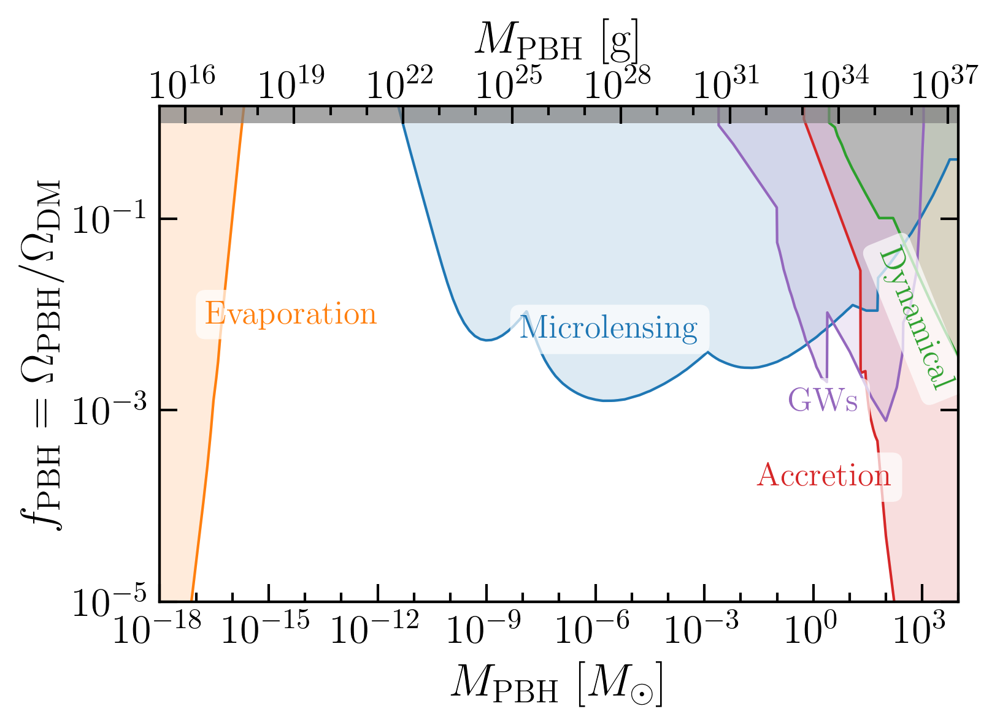

## PBHbounds


 

You can produce a plot with
```
python PlotPBHbounds.py -listfile LIST_FILE -outfile OUT_FILE
```
where `LIST_FILE` is a text file containing a list of bounds to be plotted (see `listfiles/list_all.txt` for an example) and `OUT_FILE` is the full filename of the image to be output (e.g. `PBHbounds.pdf`). The list file will be read from the `listfiles/` folder and the final image will be saved in `plots/`. You can use the short flags `-lf` and `-of` for specifying the list file and output file. 